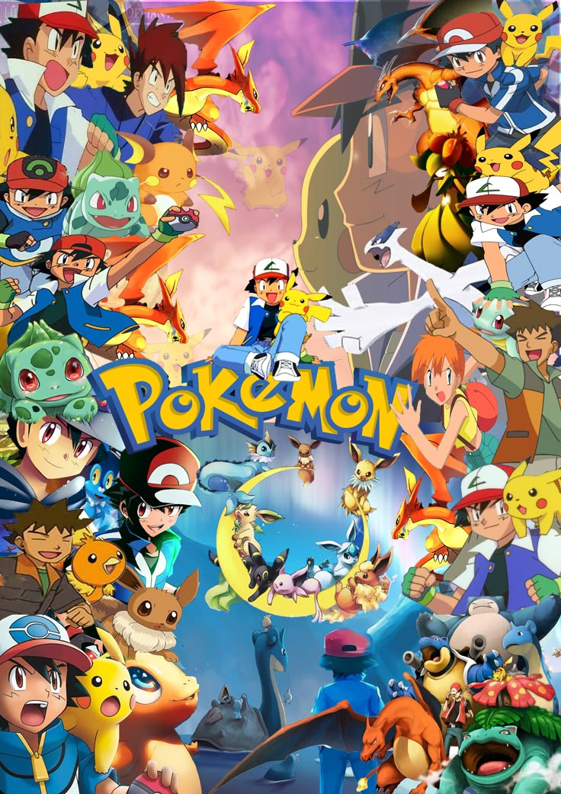

# Your Pokémon Story

Welcome to **Your Pokémon Story**! This is an interactive webpage that lets users explore and craft their own Pokémon adventure. The page includes animations, background music, and options to share your adventure on social media.

## Features
- **Interactive Pokémon Story**: Users can click to listen to the story being read aloud and choose their own path.
- **Custom Pokémon-Themed Design**: Includes a pokeball animation on the loading screen and the header.
- **Social Media Sharing**: Allows users to share the page on LinkedIn, Facebook, and WhatsApp.
- **Responsive Layout**: The page is designed to be responsive and works well on both desktop and mobile devices.

## Project Structure

### HTML
The main HTML structure includes:
- A **loading screen** with a pokeball animation.
- A **header** with a custom title that uses a Pokémon font and styled pokeball.
- A **main section** containing the interactive story.
- A **footer** with your name, a brief description, and social media sharing links.

### CSS
The custom styles are stored in `st.css` and include:
- Pokémon-themed fonts and colors.
- Animation for the loading screen pokeball.
- Styling for the header, buttons, and interactive story text.

### JavaScript
The main JavaScript functionality is stored in `main.js`, which:
- Controls the text-to-speech functionality for reading the story aloud.
- Manages the loading screen and story interactions.

## Getting Started

To view the project:

1. Clone or download the repository.
2. Open the `index.html` file in a web browser.

Alternatively, you can visit the live website at: [Your Pokémon Story](https://pokestory.netlify.app/).

### Prerequisites

No special software is required to view the project locally. Any modern web browser will work.

## Usage

### How to Play
1. Wait for the loading screen to finish.
2. Click on the **play button** to hear the story.
3. Explore the different options and make choices in the story as they appear.

### Social Media Sharing
- Share your adventure on **LinkedIn**, **Facebook**, or **WhatsApp** by clicking the social media icons at the bottom of the page.

## Technologies Used
- **HTML5**
- **CSS3**
- **JavaScript**

## Contributing

Contributions are welcome! If you have any ideas for improvements, open an issue or create a pull request.

## Credits
Created by:

 

Under the guidance of:

               

## Developer:
Kanika Chauhan

## Contacts:

